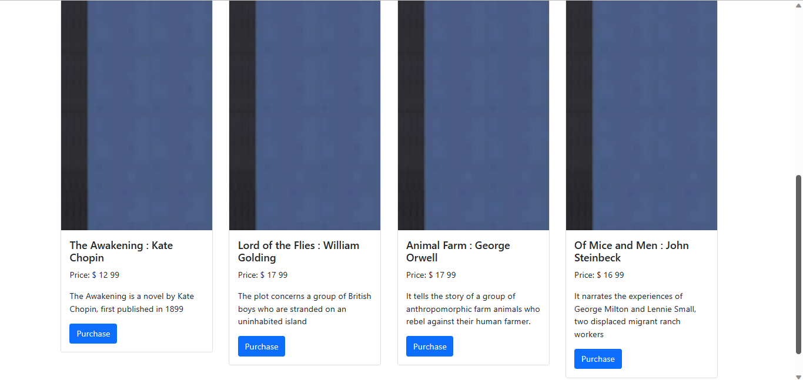
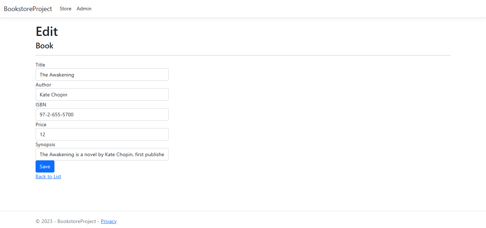
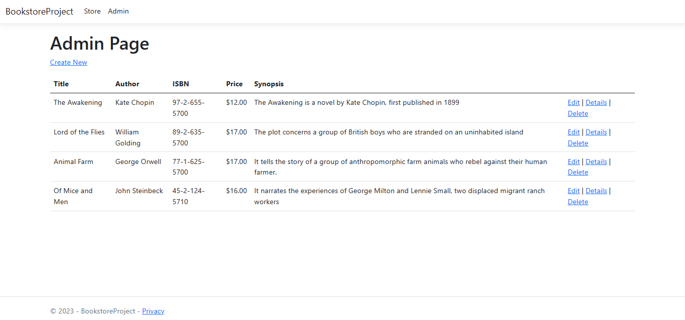

# Bookstore-ASP.NET-MVC

## Table of contents

- [Overview](#overview)
  - [Screenshot](#screenshot)
- [My process](#my-process)
  - [Built with](#built-with)
  - [What I learned](#what-i-learned)
  - [Continued development](#continued-development)
- [Author](#author)

## Overview

  ### Features

Users should be able to:

- View the optimal layout for the app depending on their device's screen size
- See hover states for all interactive elements on the page
- Create, read, update, and delete invoices
- Save draft invoices, and mark pending invoices as paid
- Filter invoices by status (draft/pending/paid)

### Screenshot

  #### Home Page

  #### Book Page

  #### Edit Page

  #### Admin Page

## My process

### Built with

- ASP.NET Core: The framework provides the foundation for building web applications, allowing for efficient handling of HTTP requests, routing, and rendering views.
- Bootstrap 5 - For styles
- SQL SERVER
- C#
- Entity Framework Core: An Object-Relational Mapping (ORM) framework that simplifies database interactions by mapping database tables to C# objects.

### What I learned

Through building an online bookstore application using the ASP.NET Core framework, I have learned numerous valuable lessons. Firstly, I gained a deep understanding of the MVC (Model-View-Controller) architecture pattern and its implementation in web development. I discovered the importance of properly designing the database schema to efficiently store and retrieve data. Additionally, I developed skills in implementing authentication and authorization mechanisms to ensure secure access for different user roles. This project allowed me to sharpen my knowledge of ASP.NET Core, C#, and SQL database management.

### Continued development

Moving forward, there are several areas I could continue to explore and learn in future projects. One aspect is enhancing the user experience by implementing features like real-time notifications, search functionality, and personalized recommendations for users. Additionally, I could delve into implementing advanced security measures like two-factor authentication and role-based access control. 

## Author

- Website - [Me](https://github.com/emmanuelmav/)
